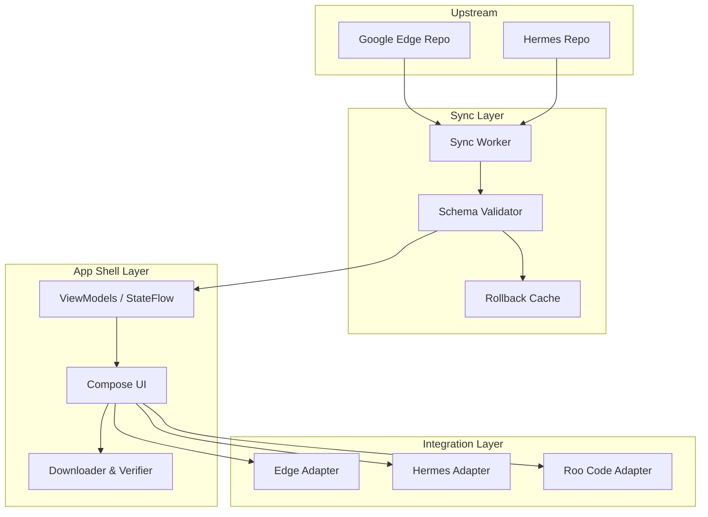

# 03_SYSTEM_ARCHITECTURE

## ARCHITECTURAL LAYERS

The system is split into three core layers to maintain upstream independence and local determinism.

### 1. Upstream Sync Layer
**Responsibility**: Poll and fetch manifests/releases from upstream repositories without pulling arbitrary code.
- **Edge Sync Worker**: Tracks Google AI Edge Gallery release tags and model catalog diffs.
- **Hermes Sync Worker**: Tracks Hermes Agent skill descriptors and prompt workflows.
- **Mechanics**: Detects version change -> Fetches payload -> Validates schema -> Stores rollback snapshot -> Emits update event.

### 2. Integration & Adapter Layer
**Responsibility**: Translates upstream schemas into the unified internal domain and handles execution translation.
- **Edge Inference Adapter**: Maps the internal `LocalModel` to Google's Edge execution runtime. Handles RAM validation and native engine loads.
- **Hermes Memory Adapter**: Maps task memory and skill execution into the local SQLite/Room database.
- **Roo Code Patch Adapter**: Provides standard diff generation and file patch application over the local file system.

### 3. App Shell Layer (The Sandbox)
**Responsibility**: UI rendering, state management, offline-policy enforcement, and storage I/O.
- **Storage Policy**: Forces all adapter outputs into secure, app-specific internal storage (`files/models/`, `files/skills/`, `files/projects/`).
- **State Engine**: MVI/MVVM architecture. ViewModels hold immutable StateFlows representing explicit system truths (e.g., `EngineState`, `InstallState`).
- **UI Composition**: Pure functional consumers of state. No business logic in Jetpack Compose.

## COMPONENT INTERACTION

## CORE PRINCIPLES
1. **Flat, Observable State**: State transitions are explicit (Available -> Downloading -> Verifying -> Installed).
2. **Never Hard-Fork**: Do not merge upstream source directly; consume manifests and use standardized API boundaries.
3. **Atomic Resilience**: Downloads write to `.tmp`. Only after SHA-256 verification does a rename occur. Same for Roo Code patches.
