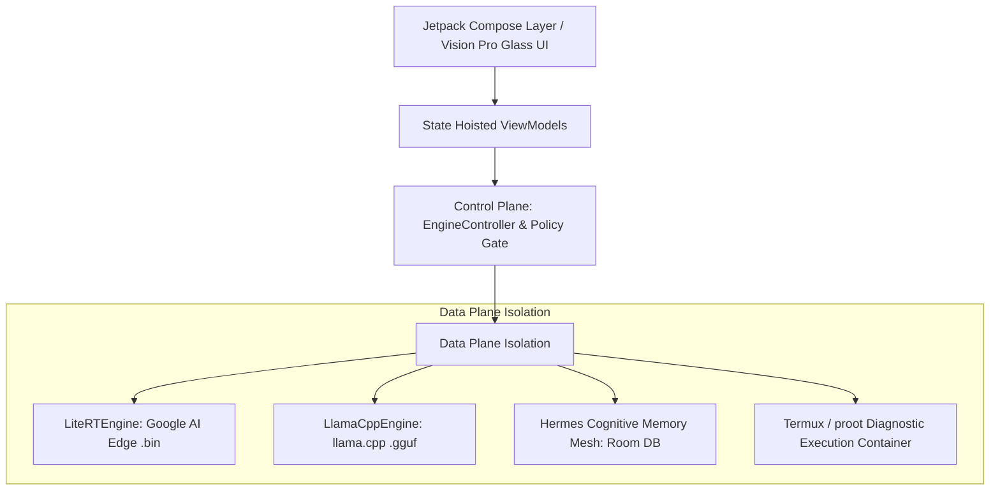

# 02 — Architecture Specification: DeepEyeLLM

## System Architecture Diagram



---

## Tech Stack Definition
- **Language**: Kotlin 2.1 / C++20 (NDK r26b)
- **UI Framework**: Jetpack Compose (Compiler 1.5+) + Material3 Adaptive
- **Dependency Injection**: Dagger Hilt 2.55 (KSP compile-time validation)
- **Asynchronous Execution**: Kotlin Coroutines 1.8 + StateFlow / SharedFlow
- **Persistence**: Room DB 2.6 (SQLCipher encrypted storage)
- **Native Inference**:
  - `com.google.ai.edge.litertlm` (LiteRT GPU/CPU)
  - `llama.cpp` JNI C++ bindings (`arm64-v8a` NEON / DotProduct)

---

## Package Directory Structure

```text
com.deepeye.agent/
├── core/
│   ├── model/         # ModelSpec, ModelBackend, Quantization
│   └── security/      # Policy check layer, access control, audit logging
├── domain/
│   ├── engine/        # LLMEngine interface, LiteRTEngine, LlamaCppEngine
│   ├── EngineController.kt # Polymorphic dispatch & memory guard
│   └── LocalModel.kt  # EngineState, LocalModel UI data class
├── analysis/          # FileAnalysisService, ToolRegistry
├── memory/            # Hermes Database, MemoryDao, EpisodicMemoryMesh
├── ui/
│   ├── chat/          # ChatScreen, ChatViewModel, ModelPickerSheet
│   ├── ide/           # IdeScreen, IdeViewModel, ZeroLatencyLayer
│   ├── models/        # ModelCatalogViewModel, ModelManagerScreen
│   ├── settings/      # SettingsScreen, SettingsViewModel
│   └── theme/         # Vision Pro Glass tokens, Color, Type
└── di/                # Hilt modules (EngineModule, AppModule, AnalysisModule)
```

---

## Control & Data Plane Isolation Rules
1. **Control Plane**:
   - Manages user navigation, model selection intents, RAM validation, and lifecycle bounds.
   - Operates strictly on main/ViewModel threads.
2. **Data Plane**:
   - Executes raw tensor math, GGUF file streaming, and SQLite memory queries.
   - Operates strictly on `Dispatchers.IO` or `Dispatchers.Default` thread pools.
   - Cross-plane interaction is gated via immutable `StateFlow<EngineStatus>` updates.
